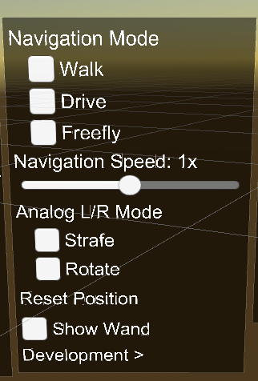
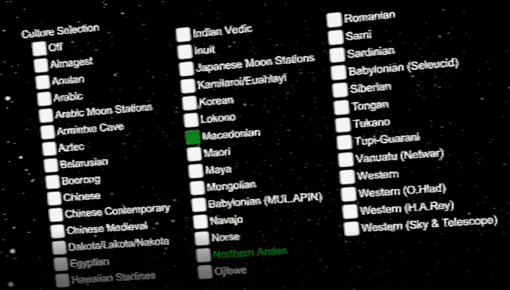
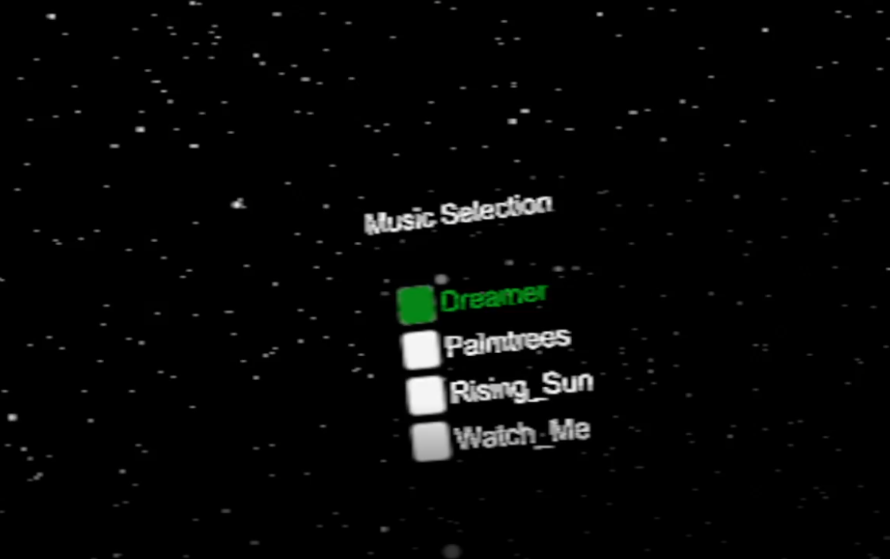
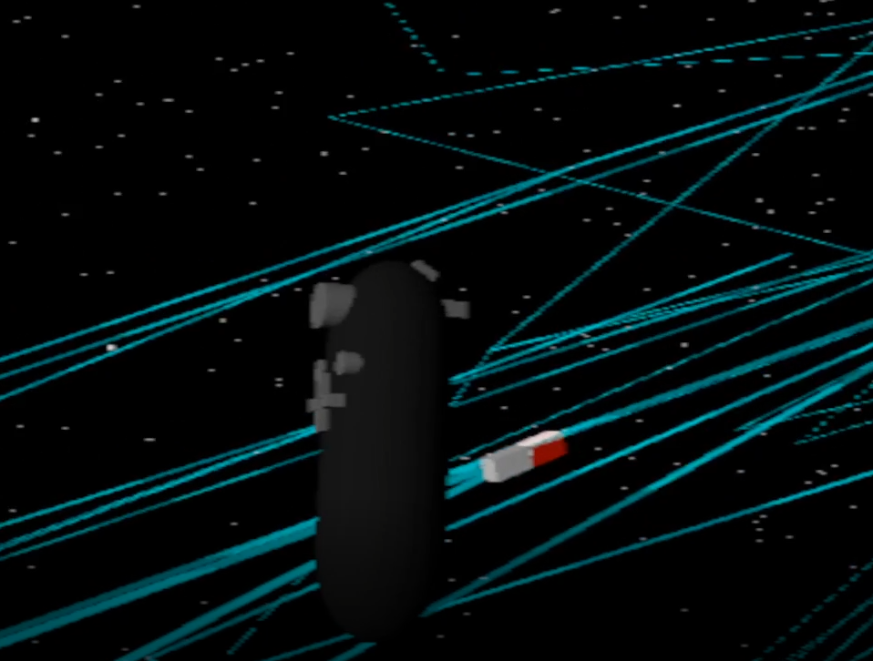
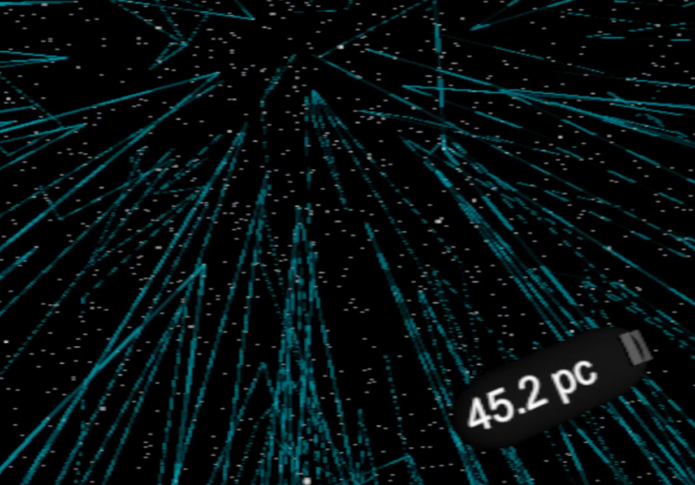
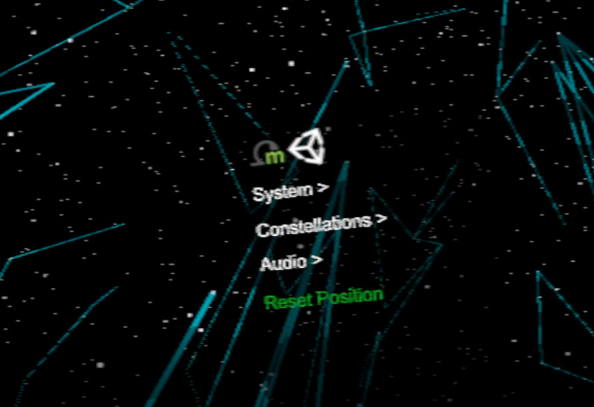

# About
This application visualizes stars from the [HYG Database](https://github.com/astronexus/HYG-Database). Users can travel through a section of the milky way and see various constellations from cultures around the world. This application was developed for CS 528 at the University of Illinois at Chicago and was built on Unity 2019.2.

#Guide
## Menus
Press the menu button on the Vive Wand to bring up the main menu of the application. From here, use the touchpad to select things, press the menu button to confirm selection, and squeeze the controller to go back. 

## Navigation
There are two main modes of navigation, drive and fly. To select a mode, go to `Main Menu -> System -> Navigation Mode`. Walk mode is not recommended.
- Drive (recommended): hold the trigger and move the controller in the direction you wish to travel
- Fly: Similar to drive, but also responds to the controllers tilt

## Constellations
Constellations from different cultures can be viewed, with the default culture showing western constellations. To select a culture set, go to `Main Menu -> Constellations` and make a selection. `Off` will remove the constellations from the visualization.

## Audio
There are several audio choices that come with the application, to choose one go to `Main Menu -> Audio` and make a selection.

## HTC Wand Tools
To help guide the user, there are two tools attached to the Vive wands in the virtual environment. The first is a compass that will always point toward Earth. The second is a text field that shows how many parsecs the user is away from Earth. To view each of these, look at the back of the controller.

## Reset Position
Since there are not many noticeable landmarks, the user can choose to reset their position to the starting position. Go to `Main Menu -> Reset Position`.

 